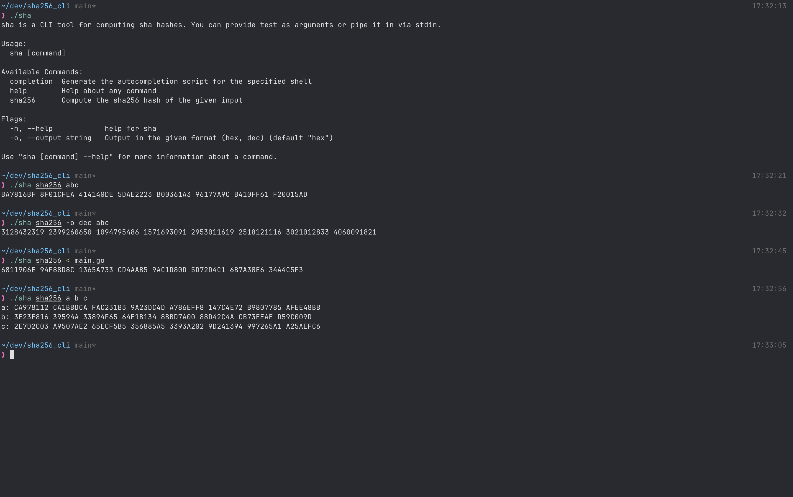

# sha

SHA-256 implemented from scratch in Go, written against the
[FIPS 180-4](https://csrc.nist.gov/pubs/fips/180-4/upd1/final) specification, with a CLI.

No `crypto/sha256` — the message schedule, compression function, and padding are all
written out, so the algorithm is readable end to end.



## Install

```
go install github.com/jellybro99/sha@latest
```

Or build from a clone:

```
go build
```

## Usage

Pass text as arguments:

```
$ sha sha256 hello
2CF24DBA 5FB0A30E 26E83B2A C5B9E29E 1B161E5C 1FA7425E 73043362 938B9824
```

Or pipe it in on stdin:

```
$ printf 'hello' | sha sha256
2CF24DBA 5FB0A30E 26E83B2A C5B9E29E 1B161E5C 1FA7425E 73043362 938B9824
```

Multiple arguments are hashed concurrently across `GOMAXPROCS` workers:

```
$ sha sha256 hello world
hello: 2CF24DBA 5FB0A30E 26E83B2A C5B9E29E 1B161E5C 1FA7425E 73043362 938B9824
world: 486EA462 24D1BB4F B680F34F 7C9AD96A 8F24EC88 BE73EA8E 5A6C6526 0E9CB8A7
```

Output format is selectable:

```
$ sha sha256 hello -o dec
754077114 1605411598 652753706 3317293726 454434396 531055198 1929655138 2475399204

$ sha sha256 hello -o bin
00101100111100100100110110111010 01011111101100001010001100001110 ...
```

| Flag | Values | Default |
| --- | --- | --- |
| `-o`, `--output` | `hex`, `dec`, `bin` | `hex` |

Run `sha sha256 --help` for the full flag list.

## Correctness

Verified against the NIST FIPS 180-4 test vectors, and cross-checked against
`shasum -a 256`:

| Input | Digest |
| --- | --- |
| `abc` | `BA7816BF 8F01CFEA 414140DE 5DAE2223 B00361A3 96177A9C B410FF61 F20015AD` |
| `hello` | `2CF24DBA 5FB0A30E 26E83B2A C5B9E29E 1B161E5C 1FA7425E 73043362 938B9824` |

## Layout

```
cmd/        cobra CLI — root command, flags, and the hashing subcommand
sha256/     the implementation
              constants      the 64 K round constants
              preprocess     padding, the message schedule, and the initial hash values
              hash           the compression rounds and the top-level Hash()
              utility        ch, maj, the Σ/σ functions, rotr, shr
main.go     entry point
```

`Hash` takes a string and returns the digest as `[8]uint32` — the eight 32-bit working
words — which the CLI formats into `hex`, `dec`, or `bin`.

## Stack

Go 1.25, [cobra](https://github.com/spf13/cobra) for the CLI.
